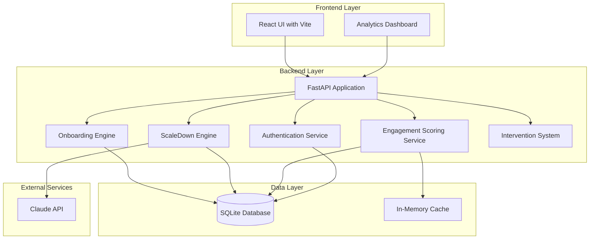
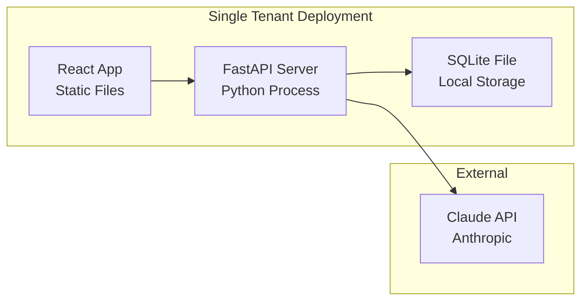
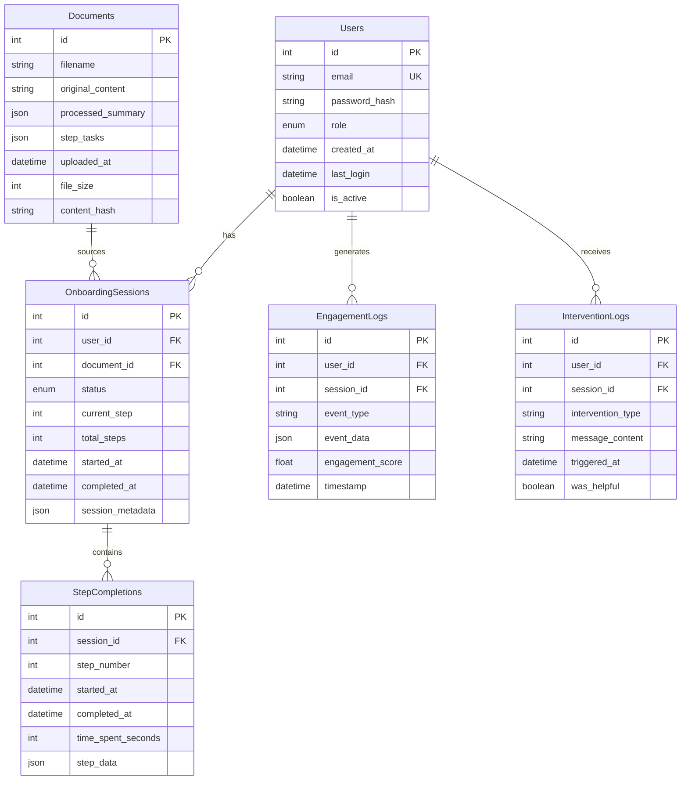

# Design Document: Customer Onboarding Agent

## Overview

The Customer Onboarding Agent is a single-tenant SaaS platform that transforms product documentation into personalized, role-based onboarding experiences. The system leverages AI-powered document processing to create concise summaries and actionable tasks, while continuously monitoring user engagement to provide timely interventions and comprehensive analytics.

The architecture follows a modern web application pattern with a React frontend, FastAPI backend, and SQLite database, integrated with Anthropic's Claude API for intelligent document processing. The system emphasizes performance through single-API-call document processing and real-time engagement tracking.

## Architecture

### High-Level Architecture



### Service Architecture Pattern

The system implements a **Service Layer Pattern** with clear separation of concerns:

- **Presentation Layer**: React components handle UI interactions and state management
- **API Layer**: FastAPI routes provide RESTful endpoints with proper validation
- **Service Layer**: Business logic encapsulated in dedicated service classes
- **Data Access Layer**: SQLAlchemy models and repositories handle database operations
- **External Integration Layer**: Claude API client with retry logic and error handling

### Deployment Architecture



## Components and Interfaces

### 1. ScaleDown Engine

**Purpose**: Processes uploaded documents through Claude API to generate summaries and task lists in a single API call.

**Key Components**:
- `DocumentProcessor`: Handles file upload validation and preprocessing
- `ClaudeClient`: Manages API communication with retry logic and rate limiting
- `ContentExtractor`: Extracts text from PDF and text files
- `ResponseParser`: Validates and structures Claude API responses

**Interface**:
```python
class ScaleDownEngine:
    async def process_document(self, file: UploadFile) -> ProcessedDocument:
        """Process document in single Claude API call"""
        
    async def validate_document(self, file: UploadFile) -> bool:
        """Validate file format and size"""
        
    def _build_claude_prompt(self, content: str) -> str:
        """Build optimized prompt for single-call processing"""
```

**Claude API Integration Strategy**:
- Single API call with structured prompt requesting both summary (25% length) and step-by-step tasks
- Exponential backoff retry logic for rate limit handling
- Response validation to ensure JSON structure compliance
- Prompt caching optimization for similar document types

### 2. Onboarding Engine

**Purpose**: Manages role-based linear onboarding flows with step progression tracking.

**Key Components**:
- `FlowManager`: Orchestrates step progression and role-based routing
- `StepRenderer`: Generates step content based on processed documents
- `ProgressTracker`: Monitors completion status and timing
- `RoleConfigManager`: Manages role-specific step configurations

**Interface**:
```python
class OnboardingEngine:
    async def start_onboarding(self, user_id: int, role: UserRole) -> OnboardingSession:
        """Initialize role-specific onboarding flow"""
        
    async def advance_step(self, session_id: int) -> StepResult:
        """Progress to next step in linear flow"""
        
    async def get_current_step(self, session_id: int) -> OnboardingStep:
        """Retrieve current step content and metadata"""
```

**Role Configuration**:
- **Developers**: 5 API-focused steps with code examples and integration guides
- **Business Users**: 3 workflow-focused steps emphasizing process and outcomes
- **Admins**: Customizable administrative steps for system management

### 3. Engagement Scoring Service

**Purpose**: Real-time calculation of user engagement scores using weighted metrics.

**Key Components**:
- `MetricsCollector`: Captures user interaction events from frontend
- `ScoreCalculator`: Applies weighted scoring algorithm
- `ActivityMonitor`: Tracks time-based engagement patterns
- `InactivityDetector`: Identifies periods of user inactivity

**Scoring Algorithm**:
```python
engagement_score = (
    step_completion_rate * 0.40 +
    normalized_time_spent * 0.30 +
    interaction_frequency * 0.20 -
    inactivity_penalty * 0.10
)
```

**Interface**:
```python
class EngagementScoringService:
    async def record_interaction(self, user_id: int, interaction: InteractionEvent):
        """Record user interaction for scoring"""
        
    async def calculate_score(self, user_id: int) -> float:
        """Calculate current engagement score (0-100)"""
        
    async def get_score_history(self, user_id: int) -> List[ScorePoint]:
        """Retrieve engagement score timeline"""
```

### 4. Intervention System

**Purpose**: Automated assistance triggered by low engagement scores.

**Key Components**:
- `ScoreMonitor`: Continuously monitors engagement scores
- `InterventionTrigger`: Determines when to activate help messages
- `ContextualHelpGenerator`: Creates relevant assistance content
- `DeduplicationManager`: Prevents spam interventions

**Interface**:
```python
class InterventionSystem:
    async def monitor_engagement(self, user_id: int):
        """Monitor user engagement and trigger interventions"""
        
    async def trigger_help(self, user_id: int, context: StepContext) -> HelpMessage:
        """Generate contextual help message"""
        
    def _should_intervene(self, score: float, last_intervention: datetime) -> bool:
        """Determine if intervention is needed"""
```

### 5. Analytics Dashboard

**Purpose**: Comprehensive reporting interface for activation rates and user behavior analysis.

**Key Components**:
- `MetricsAggregator`: Compiles user data into analytical insights
- `VisualizationEngine`: Generates charts and graphs for data presentation
- `FilterManager`: Handles role-based and time-based filtering
- `ExportService`: Provides data export capabilities

**Interface**:
```python
class AnalyticsDashboard:
    async def get_activation_rates(self, filters: AnalyticsFilters) -> ActivationMetrics:
        """Calculate activation rates by role and time period"""
        
    async def get_dropoff_analysis(self, filters: AnalyticsFilters) -> DropoffData:
        """Analyze step-by-step completion rates"""
        
    async def get_engagement_trends(self, filters: AnalyticsFilters) -> TrendData:
        """Track engagement score patterns over time"""
```

## Data Models

### Database Schema



### SQLAlchemy Models

**User Model**:
```python
class User(Base):
    __tablename__ = "users"
    
    id = Column(Integer, primary_key=True, index=True)
    email = Column(String, unique=True, index=True, nullable=False)
    password_hash = Column(String, nullable=False)
    role = Column(Enum(UserRole), nullable=False)
    created_at = Column(DateTime, default=datetime.utcnow)
    last_login = Column(DateTime)
    is_active = Column(Boolean, default=True)
    
    # Relationships
    onboarding_sessions = relationship("OnboardingSession", back_populates="user")
    engagement_logs = relationship("EngagementLog", back_populates="user")
```

**Document Model**:
```python
class Document(Base):
    __tablename__ = "documents"
    
    id = Column(Integer, primary_key=True, index=True)
    filename = Column(String, nullable=False)
    original_content = Column(Text, nullable=False)
    processed_summary = Column(JSON)
    step_tasks = Column(JSON)
    uploaded_at = Column(DateTime, default=datetime.utcnow)
    file_size = Column(Integer)
    content_hash = Column(String, unique=True, index=True)
```

**OnboardingSession Model**:
```python
class OnboardingSession(Base):
    __tablename__ = "onboarding_sessions"
    
    id = Column(Integer, primary_key=True, index=True)
    user_id = Column(Integer, ForeignKey("users.id"), nullable=False)
    document_id = Column(Integer, ForeignKey("documents.id"), nullable=False)
    status = Column(Enum(SessionStatus), default=SessionStatus.ACTIVE)
    current_step = Column(Integer, default=1)
    total_steps = Column(Integer, nullable=False)
    started_at = Column(DateTime, default=datetime.utcnow)
    completed_at = Column(DateTime)
    session_metadata = Column(JSON)
    
    # Relationships
    user = relationship("User", back_populates="onboarding_sessions")
    document = relationship("Document")
    step_completions = relationship("StepCompletion", back_populates="session")
```

### Pydantic Schemas

**Request/Response Models**:
```python
class DocumentUploadRequest(BaseModel):
    file: UploadFile
    
class ProcessedDocumentResponse(BaseModel):
    id: int
    filename: str
    summary: str
    tasks: List[str]
    processing_time: float
    
class OnboardingStepResponse(BaseModel):
    step_number: int
    total_steps: int
    title: str
    content: str
    tasks: List[str]
    estimated_time: int
    
class EngagementScoreResponse(BaseModel):
    current_score: float
    score_history: List[ScorePoint]
    last_updated: datetime
```

## Error Handling

### Claude API Error Handling

**Rate Limit Management**:
```python
class ClaudeAPIClient:
    async def _make_request_with_retry(self, prompt: str, max_retries: int = 3):
        for attempt in range(max_retries):
            try:
                response = await self.client.messages.create(...)
                return response
            except RateLimitError as e:
                if attempt == max_retries - 1:
                    raise
                wait_time = min(2 ** attempt, 60)  # Exponential backoff
                await asyncio.sleep(wait_time)
            except APIError as e:
                logger.error(f"Claude API error: {e}")
                raise ProcessingError(f"Document processing failed: {str(e)}")
```

**Error Categories**:
- **Rate Limit Errors**: Exponential backoff with maximum retry attempts
- **Authentication Errors**: Immediate failure with clear error message
- **Content Errors**: Validation failure with specific feedback
- **Network Errors**: Retry with timeout handling
- **Processing Errors**: Graceful degradation with fallback responses

### Database Error Handling

**Connection Management**:
```python
class DatabaseManager:
    async def execute_with_retry(self, operation, max_retries: int = 3):
        for attempt in range(max_retries):
            try:
                async with self.session() as db:
                    return await operation(db)
            except SQLAlchemyError as e:
                if attempt == max_retries - 1:
                    logger.error(f"Database operation failed: {e}")
                    raise DatabaseError("Operation failed after retries")
                await asyncio.sleep(0.1 * (2 ** attempt))
```

### Frontend Error Handling

**React Error Boundaries**:
```typescript
class OnboardingErrorBoundary extends React.Component {
    componentDidCatch(error: Error, errorInfo: ErrorInfo) {
        // Log error to engagement tracking
        trackEngagementEvent({
            type: 'error',
            error: error.message,
            context: errorInfo.componentStack
        });
    }
}
```

## Testing Strategy

### Dual Testing Approach

The system employs both unit testing and property-based testing for comprehensive coverage:

**Unit Tests**:
- Specific examples and edge cases for each component
- Integration points between services
- Error condition handling
- Mock external dependencies (Claude API, database)

**Property-Based Tests**:
- Universal properties that hold across all inputs
- Minimum 100 iterations per property test
- Each test tagged with: **Feature: customer-onboarding-agent, Property {number}: {property_text}**
- Comprehensive input coverage through randomization

**Testing Framework Configuration**:
- **Backend**: pytest with pytest-asyncio for async testing
- **Property Testing**: Hypothesis for Python property-based tests
- **Frontend**: Jest and React Testing Library
- **Integration**: TestContainers for database testing
- **API Testing**: httpx for async API client testing

**Test Environment Setup**:
- Separate SQLite databases for testing
- Mock Claude API responses for consistent testing
- Automated test data generation for realistic scenarios
- CI/CD pipeline integration with test coverage reporting

## Correctness Properties

*A property is a characteristic or behavior that should hold true across all valid executions of a system—essentially, a formal statement about what the system should do. Properties serve as the bridge between human-readable specifications and machine-verifiable correctness guarantees.*

Based on the prework analysis and property reflection to eliminate redundancy, the following properties ensure system correctness:

### Property 1: Single API Call Document Processing
*For any* valid document upload, the ScaleDown_Engine should process the entire document in exactly one Claude API call and return structured JSON containing both summary (approximately 25% of original length) and step-by-step tasks.
**Validates: Requirements 1.1, 1.2, 1.3**

### Property 2: Role-Based Step Count Consistency  
*For any* user with a specific role, the Onboarding_Engine should serve the correct number of steps: Developers get exactly 5 API-focused steps, Business_Users get exactly 3 workflow-focused steps.
**Validates: Requirements 2.1, 2.2**

### Property 3: Linear Step Progression
*For any* user in an active onboarding session, completing the current step should advance them to the next step in sequence, and completing the final step should mark onboarding as complete.
**Validates: Requirements 2.4, 2.5**

### Property 4: Engagement Score Calculation Accuracy
*For any* user activity data, the Engagement_Scoring_Service should calculate scores using the exact weighted formula: step_completion(40%) + time_spent(30%) + interactions(20%) - inactivity_penalty(10%), with results always between 0-100 inclusive.
**Validates: Requirements 3.1, 3.2, 3.3, 3.4, 3.6**

### Property 5: Real-Time Score Updates
*For any* user activity event, the engagement score should be updated within 5 seconds of the activity occurring.
**Validates: Requirements 3.5**

### Property 6: Intervention Threshold Triggering
*For any* user whose engagement score falls below 30, the Intervention_System should trigger exactly one contextual help message and log the intervention event, with no duplicate messages within a 5-minute window.
**Validates: Requirements 4.1, 4.2, 4.3, 4.4**

### Property 7: Analytics Data Aggregation
*For any* analytics request, the dashboard should aggregate data from all user sessions and display activation rates as percentages with accurate step-by-step drop-off statistics.
**Validates: Requirements 5.1, 5.2, 5.3**

### Property 8: Real-Time Analytics Updates
*For any* completed onboarding activity, analytics metrics should update immediately and filtering by role/time period should return accurate subsets of data.
**Validates: Requirements 5.4, 5.5**

### Property 9: User Role Assignment and Authentication
*For any* user registration, the system should assign exactly one of three valid roles (Developer, Business_User, Admin), and successful authentication should establish secure sessions while preventing unauthorized access to role-specific content.
**Validates: Requirements 6.1, 6.2, 6.5**

### Property 10: Data Persistence Consistency
*For any* user data operation, information should be correctly persisted to SQLite using SQLAlchemy and maintain user profiles with accurate role assignments and onboarding progress.
**Validates: Requirements 6.3, 6.4**

### Property 11: API Response Format Consistency
*For any* API request, the system should return appropriate HTTP status codes with valid JSON responses, and invalid requests should return proper error responses without exposing sensitive information.
**Validates: Requirements 7.4, 7.5, 9.5**

### Property 12: Frontend Interaction Tracking
*For any* user interface interaction, the system should provide immediate visual feedback, track the interaction for engagement scoring, and maintain responsive design across different screen sizes.
**Validates: Requirements 8.2, 8.3, 8.4, 8.5**

### Property 13: Error Handling and Recovery
*For any* document processing failure or system error, the system should return descriptive error messages, maintain system stability, and handle Claude API rate limits with appropriate retry mechanisms.
**Validates: Requirements 1.4, 1.5, 9.2**

### Property 14: Data Integrity Under Concurrency
*For any* concurrent database operations, the system should ensure data consistency, prevent corruption, and log all critical operations for monitoring purposes.
**Validates: Requirements 9.3, 9.4**

### Example-Based Properties

The following requirements are better validated through specific examples rather than universal properties:

**API Endpoint Availability**: Verify that REST API endpoints exist for Onboard, Scaledown, and Analytics modules.
**Validates: Requirements 7.1, 7.2, 7.3**

**Technology Stack Verification**: Confirm React/Vite frontend and SQLite database schema with required tables.
**Validates: Requirements 7.6, 8.1**

**Performance Requirements**: Load testing to verify 2-second response times under concurrent access.
**Validates: Requirements 9.1**