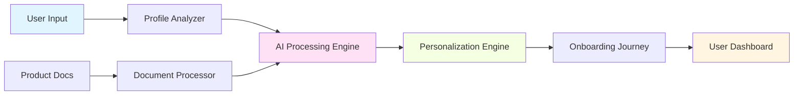

<div align="center">

# 🤖 Customer Onboarding Agent


[](https://github.com/atharvax26/Customer-Onboarding-Agent/stargazers)
[](https://github.com/atharvax26/Customer-Onboarding-Agent/network/members)
[](https://github.com/atharvax26/Customer-Onboarding-Agent/issues)
[](LICENSE)

<p align="center">
  
  
  
</p>

---

### 🎯 Revolutionizing Customer Onboarding with AI

*An intelligent automation system that transforms product documentation and user profiles into personalized onboarding experiences*

</div>

---

## 📋 Table of Contents

- [🌟 Overview](#-overview)
- [✨ Key Features](#-key-features)
- [🏗️ Architecture](#️-architecture)
- [🚀 Getting Started](#-getting-started)
- [💡 How It Works](#-how-it-works)
- [🛠️ Tech Stack](#️-tech-stack)
- [📊 Use Cases](#-use-cases)
- [🤝 Contributing](#-contributing)
- [📄 License](#-license)
- [📞 Contact](#-contact)

---

## 🌟 Overview

<div align="center">

</div>

The **Customer Onboarding Agent** is an advanced AI-powered system designed to streamline and personalize the customer onboarding process. By intelligently processing product documentation and analyzing user profiles, it creates tailored onboarding experiences that enhance user engagement and reduce time-to-value.

### 🎯 Project Goal

> To create an onboarding automation system that compresses product documentation and user profiles, personalizing the experience efficiently.

---

## ✨ Key Features

<table>
<tr>
<td width="50%">

### 🧠 Intelligent Processing
- **Smart Documentation Compression**: AI-powered summarization of complex product docs
- **Context-Aware Analysis**: Understands user needs and background
- **Adaptive Learning**: Improves recommendations over time

</td>
<td width="50%">

### 🎨 Personalization
- **User Profile Analysis**: Deep understanding of user requirements
- **Custom Onboarding Paths**: Tailored journeys for each user
- **Dynamic Content Delivery**: Right information at the right time

</td>
</tr>
<tr>
<td width="50%">

### ⚡ Efficiency
- **Automated Workflows**: Reduces manual intervention
- **Quick Setup**: Get started in minutes
- **Scalable Architecture**: Handles growing user base

</td>
<td width="50%">

### 📊 Analytics
- **Progress Tracking**: Monitor user onboarding journey
- **Engagement Metrics**: Understand user behavior
- **Optimization Insights**: Data-driven improvements

</td>
</tr>
</table>

---

## 🏗️ Architecture

<div align="center">



</div>

### 🔄 System Flow

1. **Input Collection** → User profiles and product documentation are ingested
2. **AI Analysis** → Machine learning models process and understand the content
3. **Personalization** → Custom onboarding paths are generated
4. **Delivery** → Users receive tailored onboarding experiences
5. **Feedback Loop** → System learns and adapts from user interactions

---

## 🚀 Getting Started

### Prerequisites

Before you begin, ensure you have the following installed:

```bash
- Python 3.8+
- pip
- virtualenv (recommended)
- Git
```

### Installation

<details>
<summary><b>⚙️ Step-by-Step Installation Guide</b></summary>

#### 1️⃣ Clone the Repository

```bash
git clone https://github.com/atharvax26/Customer-Onboarding-Agent.git
cd Customer-Onboarding-Agent
```

#### 2️⃣ Create Virtual Environment

```bash
python -m venv venv
source venv/bin/activate  # On Windows: venv\Scripts\activate
```

#### 3️⃣ Install Dependencies

```bash
pip install -r requirements.txt
```

#### 4️⃣ Set Up Environment Variables

```bash
cp .env.example .env
# Edit .env with your configuration
```

#### 5️⃣ Initialize Database

```bash
python manage.py migrate
```

#### 6️⃣ Run the Application

```bash
python manage.py runserver
```

🎉 **Success!** Navigate to `http://localhost:8000` to access the application.

</details>

---

## 💡 How It Works

<div align="center">

### 🔍 The Onboarding Process

</div>

| Step | Process | Description |
|------|---------|-------------|
| 1️⃣ | **Profile Creation** | User provides information about their role, goals, and experience level |
| 2️⃣ | **Document Analysis** | AI processes product documentation and extracts relevant information |
| 3️⃣ | **Path Generation** | System creates a personalized onboarding roadmap |
| 4️⃣ | **Content Delivery** | User receives curated content in digestible formats |
| 5️⃣ | **Progress Tracking** | System monitors completion and adjusts recommendations |

<div align="center">

</div>

---

## 🛠️ Tech Stack

<div align="center">

### Core Technologies

<p>


</p>

### Data & Storage

<p>


</p>

### Frontend

<p>


</p>

### DevOps & Tools

<p>


</p>

</div>

---

## 📊 Use Cases

<div align="center">

<table>
<tr>
<td align="center" width="33%">

<h3>🏢 SaaS Platforms</h3>
<p>Streamline user onboarding for complex software products</p>
</td>
<td align="center" width="33%">

<h3>🎓 EdTech</h3>
<p>Personalized learning paths for students</p>
</td>
<td align="center" width="33%">

<h3>🏦 FinTech</h3>
<p>Compliant and efficient customer onboarding</p>
</td>
</tr>
</table>

</div>

---

## 🎯 Roadmap

- [x] Core AI engine development
- [x] User profile analysis
- [x] Document processing pipeline
- [ ] Multi-language support
- [ ] Advanced analytics dashboard
- [ ] Mobile application
- [ ] Integration marketplace
- [ ] Enterprise features

---

## 🤝 Contributing

<div align="center">

We love contributions! 💙


</div>

### How to Contribute

1. **Fork** the repository
2. **Create** your feature branch (`git checkout -b feature/AmazingFeature`)
3. **Commit** your changes (`git commit -m 'Add some AmazingFeature'`)
4. **Push** to the branch (`git push origin feature/AmazingFeature`)
5. **Open** a Pull Request

### Contribution Guidelines

- Follow PEP 8 style guide for Python code
- Write meaningful commit messages
- Add tests for new features
- Update documentation as needed
- Be respectful and constructive in discussions

---

## 📊 Project Stats

<div align="center">


</div>

---

## 📄 License

<div align="center">

This project is licensed under the **MIT License** - see the [LICENSE](LICENSE) file for details.

[](https://opensource.org/licenses/MIT)

</div>

---

## 📞 Contact

<div align="center">

### Get in Touch! 👋

<p>
<a href="https://github.com/atharvax26"></a>
<a href="https://linkedin.com/in/atharvax26"></a>
<a href="mailto:contact@example.com"></a>
</p>

---

### ⭐ Show Your Support

If you find this project helpful, please consider giving it a star! It helps others discover the project.

<a href="https://github.com/atharvax26/Customer-Onboarding-Agent">
  
</a>

---


**Made with ❤️ by the Customer Onboarding Agent Team**

<sub>© 2024 Customer Onboarding Agent. All rights reserved.</sub>

</div>
